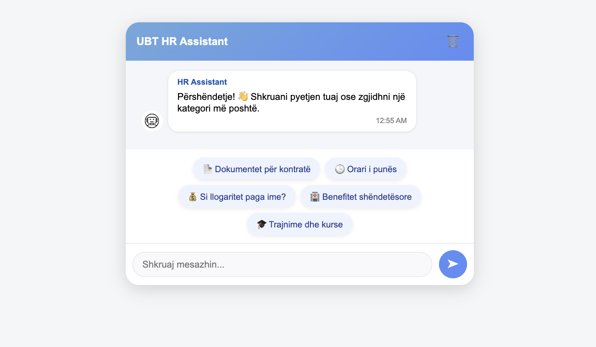

#  UBT HR Assistant

**UBT HR Assistant** është një sistem inteligjent për asistencë në menaxhimin e burimeve njerëzore, i zhvilluar si pjesë e punimit të diplomës në **Universitetin për Biznes dhe Teknologji (UBT)**.  
Sistemi mundëson ndërveprim në kohë reale midis përdoruesit dhe sistemit përmes integrimit të **ChatGPT API**, duke ofruar përgjigje automatike dhe komunikim natyral për pyetje të zakonshme të HR.

---

###  Pamje nga ndërfaqja

---

##  Teknologjitë e përdorura

###  Backend
- **ASP.NET Core Web API (C#)**
- **DotNetEnv** – për menaxhimin e `.env` files
- **OpenAI.GPT3 SDK** – për lidhje me ChatGPT API

###  Frontend
- **React.js (Create React App)**
- **Axios** – për komunikim me backend-in
- **TailwindCSS / Ant Design (sipas nevojës për UI)**
- **Node.js** dhe **npm**

---

##  Si të ekzekutohet projekti lokalisht
```bash
### 🔹 1. Klono projektin

git clone https://github.com/EraGashii/UBT-HR-Assistant.git
cd UBT-HR-Assistant

🔹 2. Backend (ASP.NET Core Web API)
cd backend/BackendApi
dotnet restore

Krijo një file .env në këtë directory me këtë përmbajtje:

OPENAI_API_KEY=sk-proj-xxxxxxxxxxxxxxxxxxxx

Pastaj nis backend-in:

dotnet run

Aplikacioni do të ekzekutohet në:

http://localhost:5148
```
🔹 3. Frontend (React.js)
```bash
cd frontend
npm install
npm start

Aplikacioni do të hapet automatikisht në browser në:

http://localhost:3000
```
 ##Frontend Dependencies
```bash

Ky projekt përdor paketat e mëposhtme:

{
  "@testing-library/dom": "^10.4.1",
  "@testing-library/jest-dom": "^6.9.0",
  "@testing-library/react": "^16.3.0",
  "@testing-library/user-event": "^13.5.0",
  "react": "^19.1.1",
  "react-dom": "^19.1.1",
  "react-scripts": "5.0.1",
  "web-vitals": "^2.1.4"
}
```

Struktura e projektit

```bash
UBT-HR-Assistant/
├── backend/
│   └── BackendApi/
│       ├── Controllers/
│       ├── Models/
│       ├── Properties/
│       ├── Program.cs
│       └── .env
│
├── frontend/
│   ├── src/
│   ├── public/
│   └── package.json
│
└── README.md

```


------------------------------------------------------------------------------------------------------------

  Funksionalitetet kryesore

Ndërveprim në kohë reale me ChatGPT API

Përgjigje inteligjente për pyetje të stafit

Menaxhim i komunikimit HR → punonjës

Strukturë e ndarë për backend dhe frontend

Siguri përmes ruajtjes lokale të API keys


------------------------------------------------------------------------------------------------------------


 Siguria
 
.env është përjashtuar nga GitHub përmes .gitignore

API key ruhet vetëm lokalisht (nuk publikohet në kod)

Siguron mbrojtje nga abuzimi dhe çaktivizimi automatik i API-ve

----------------------------------------------------------------------------------------

Ky projekt demonstron përdorimin praktik të inteligjencës artificiale në menaxhimin e proceseve HR,
duke ofruar komunikim të shpejtë, efikas dhe të automatizuar midis stafit dhe sistemit.
